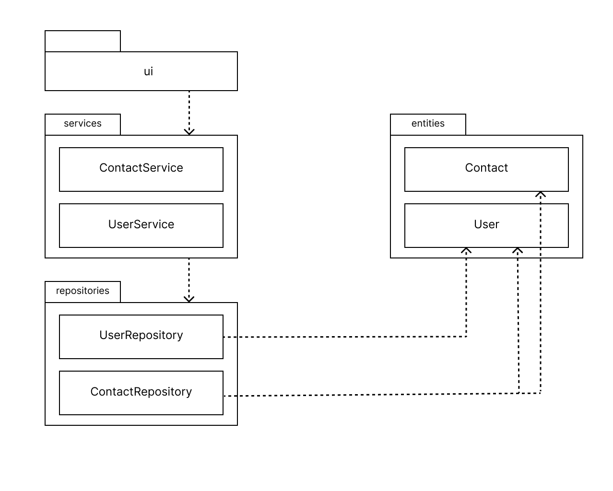
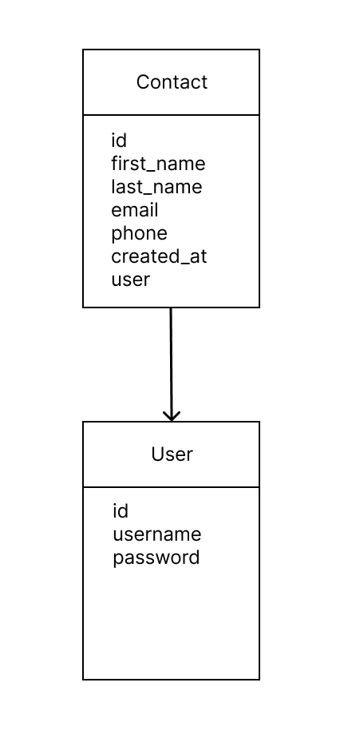
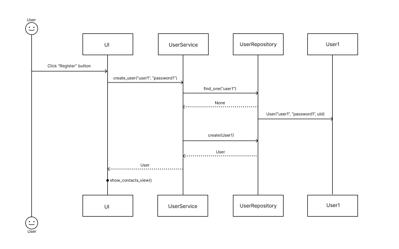

# Arkkitehtuurikuvaus

## Rakenne

Ohjelman rakenne noudattaa kerrosarkkitehtuuria, jonka pakkausrakenne on seuraava:

Pakkaus _UI_ sisältää sovelluksen käyttöliittymäkoodin.
Pakkaus _services_ vastaa sovelluslogiikasta ja koostuu seuraavista osista:

- ContactService joka vastaa kontaktien hallinnoinnin sovelluslogiikasta
- UserService joka vastaa käyttäjien hallinnoinnin sovelluslogiikasta

## Käyttöliittymä

Sovelluksen käyttöliittymä koostuu seuraavista näkymistä ja luokista:

- Kirjautumisnäkymä (login_view)
- Rekisteröitymisnäkymä (register_view)
- Kontaktien listausnäkymä (contacts_view)
- Kontaktien luomisnäkymä (contacts_form_view)

Käyttöliittymän luokat kutsuvat sovelluslogiikasta vastaavien UserServicen sekä ContactsServicen metodeja, mutta ei itsessään toteuta sovelluslogiikkaa.

## Sovelluslogiikka

Sovelluksen tietomallin muodostavat luokat _User_ ja _Contact_, jotka kuvaavat käyttäjiä ja käyttäjien tallentamia yhteystietoja. Näitä tietomalleja hallinnoivat sovelluksen sovelluslogiikasta vastaavat luokat _ContactService_ ja _UserService_.

### ContactService

Luokka _ContactService_ vastaa käyttöliittymän kontaktilistauksen ja kontaktilomakkeen toimintojen metodeista, joita ovat:

- get_contacts(user_id)
- create_contact(self, first_name, last_name, email, phone, role, user_id)
- delete_all(user_id)

_ContactService_ pääsee käsiksi kontaktien tallennuksesta/hakemisesta/poistamisesta vastaavan pakkauksessa repositories sijaitsevan luokan ContactRepository kautta.

### UserService

Luokka _UserService_ vastaa käyttöliittymän kirjautumisen ja rekisteröitymisen toimintojen metodeista sekä tämänhetkisen käyttäjän id'n tarkistamisesta:

- get_users()
- get_current()
- create_user(username, password)
- logout()
- login(username password)

_UserService_ pääsee käsiksi käyttäjän luomisesta ja hakemisesta vastaavan pakkauksessa repositories sijaitsevan luokan UserRepository kautta.

## Repositories

Pakkaus _repositories_ vastaa tietojen pysyväistallennuksesta tietokantaan, ja koostuu seuraavista osista:

- ContactRepository joka vastaa kontaktien tietojen pysyväistallennuksesta
- UserRepositoryn joka vastaa käyttäjien tietojen pysyväistallennuksesta

Pakkaus _entities_ sisältää luokkia, jotka kuvaavat sovelluksen käyttämiä tietueita User ja Contact

## Tietojen pysyväistallennus

Pakkauksen repositories luokat UserRepository ja ContactRepository vastaavat tietojen pysyväistallennuksesta SQLite-tietokantaan. Molemmat luokat noudattavat repository-suunnittelumallia.

SQLite-tietokannan taulut users ja contacts alustetaan [initialize_database.py](https://github.com/ranven/contactbook/blob/main/src/initialize_db.py)-tiedostossa.

# Päätoiminnallisuudet

## Käyttäjän kirjautuminen

Kirjautumisnäkymässä käyttäjän syötettyä käyttäjänimen, salasanan sekä painettua login-painiketta, toimii sovellus seuraavanlaisesti:

Login-painikkeen tapahtumankäsittelijä kutsuu sovelluslogiikan käyttäjiä hallinnoivan UserServicen metodia login parametreilla käyttäjätunnus ja salasana. Sovelluslogiikka kutsuu UserRepositoryn find_one-metodia tarkistaakseen onko käyttäjä olemassa. Mikäli käyttäjää ei löydy, UserService keskeyttää kirjautumisen ja ilmoittaa käyttäjälle virheestä. Mikäli käyttäjä löytyy, palauttaa metodi käyttäjän UserServicelle.

Kun UserService saa käyttäjän, tarkistaa se täsmääkö annettu salasana tietokannassa olevan käyttäjän salasanan kanssa. Jos salasana täsmää, kirjautuminen onnistuu ja käyttöliittymän näkymäksi vaihtuu ContactsView, johon sovellus renderöi kirjautuneen käyttäjän tallentamat kontaktit.

## Uuden käyttäjän luominen

Rekisteröitymisnäkymässä käyttäjän syötettyä yli 4 merkkiä pitkän uniikin käyttäjänimen, yli 4 merkkiä pitkän salasanan sekä painettua register-painiketta, toimii sovellus seuraavanlaisesti:

Register-painikkeen tapahtumankäsittelijä kutsuu sovelluslogiikan käyttäjiä hallinnoivan UserServicen metodia create_user parametreilla käyttäjätunnus ja salasana. Sovelluslogiikka kutsuu UserRepositoryn find_one-metodia tarkistaakseen onko käyttäjänimi jo käytössä. Mikäli samanniminen käyttäjä löytyy, UserService keskeyttää rekisteröitymisen ja ilmoittaa käyttäjälle virheestä. Mikäli käyttäjää ei löydy, palauttaa metodi None-arvon UserServicelle.

Kun UserService varmistuu käyttäjänimen saatavuudesta, luo se User-olion johon se generoi uuid-kirjaston avulla käyttäjän uniikin id'n. Tämän jälkeen sovelluslogiikka tallettaa käyttäjä-olion tietokantaan kutsumalla UserRepositoryn metodia create parametrilla User. Onnistuneen tallentamisen seurauksena käyttäjä kirjataan sisään ja käyttöliittymän näkymäksi vaihtuu ContactsView, johon sovellus renderöi kirjautuneen käyttäjän tallentamat kontaktit.
