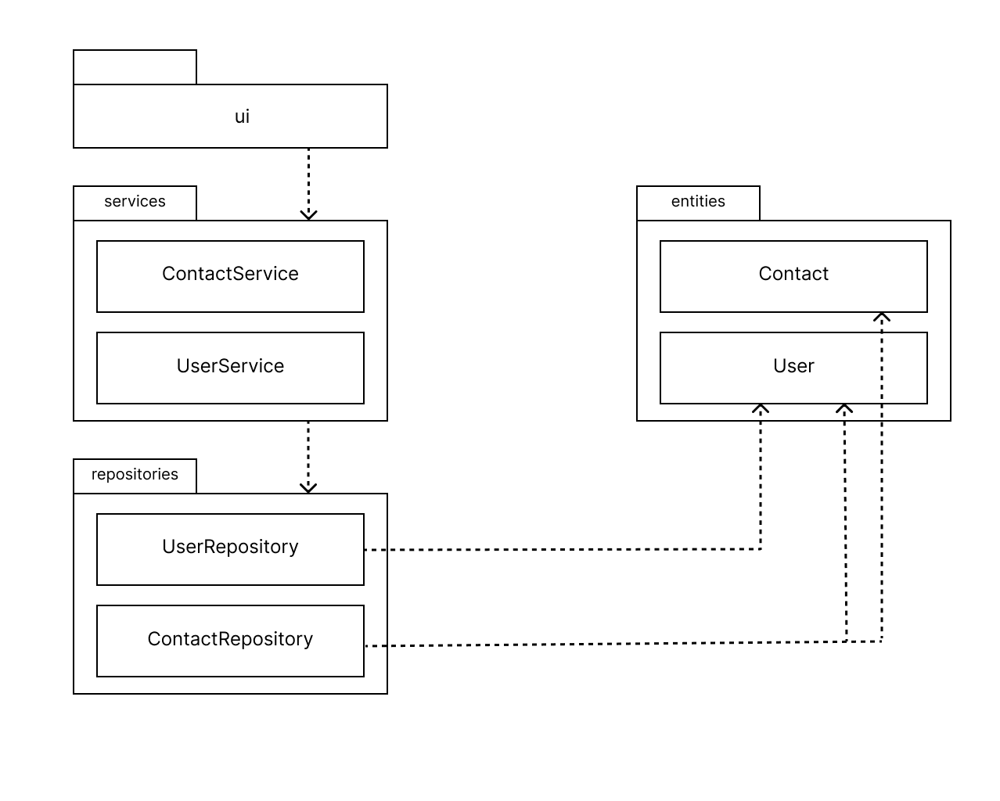
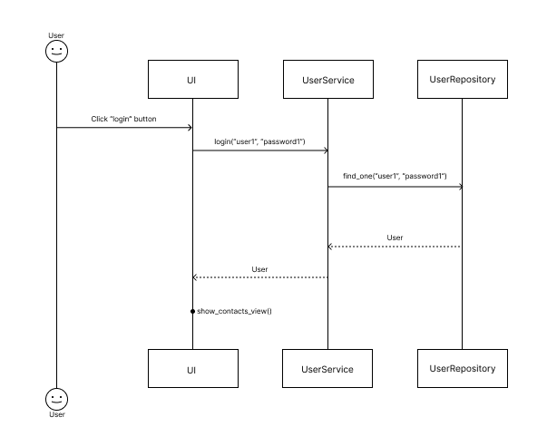
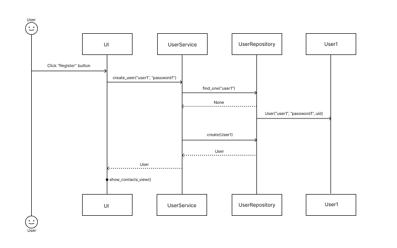

# Arkkitehtuurikuvaus

Ohjelman rakenne noudattaa kerrosarkkitehtuuria, jonka pakkausrakenne on seuraava:

Pakkaus _UI_ sisältää sovelluksen käyttöliittymäkoodin.
Pakkaus _services_ vastaa sovelluslogiikasta ja koostuu seuraavista osista:

- ContactService joka vastaa kontaktien hallinnoinnin sovelluslogiikasta
- UserService joka vastaa käyttäjien hallinnoinnin sovelluslogiikasta

Pakkaus _repositories_ vastaa tietojen pysyväistallennuksesta tietokantaan, ja koostuu seuraavista osista:

- ContactRepository joka vastaa kontaktien tietojen pysyväistallennuksesta
- UserRepositoryn joka vastaa käyttäjien tietojen pysyväistallennuksesta

Pakkaus _entities_ sisältää luokkia, jotka kuvaavat sovelluksen käyttämiä tietueita User ja COntact

# Päätoiminnallisuudet

## Käyttäjän kirjautuminen

Kirjautumisnäkymässä käyttäjän syötettyä käyttäjänimen, salasanan sekä painettua login-painiketta, toimii sovellus seuraavanlaisesti:

Login-painikkeen tapahtumankäsittelijä kutsuu sovelluslogiikan käyttäjiä hallinnoivan UserServicen metodia login parametreilla käyttäjätunnus ja salasana. Sovelluslogiikka kutsuu UserRepositoryn find_one-metodia tarkistaakseen onko käyttäjä olemassa. Mikäli käyttäjää ei löydy, UserService keskeyttää kirjautumisen ja ilmoittaa käyttäjälle virheestä. Mikäli käyttäjä löytyy, palauttaa metodi käyttäjän UserServicelle.

Kun UserService saa käyttäjän, tarkistaa se täsmääkö annettu salasana tietokannassa olevan käyttäjän salasanan kanssa. Jos salasana täsmää, kirjautuminen onnistuu ja käyttöliittymän näkymäksi vaihtuu ContactsView, johon sovellus renderöi kirjautuneen käyttäjän tallentamat kontaktit.

## Uuden käyttäjän luominen

Rekisteröitymisnäkymässä käyttäjän syötettyä yli 4 merkkiä pitkän uniikin käyttäjänimen, yli 4 merkkiä pitkän salasanan sekä painettua register-painiketta, toimii sovellus seuraavanlaisesti:

Register-painikkeen tapahtumankäsittelijä kutsuu sovelluslogiikan käyttäjiä hallinnoivan UserServicen metodia create_user parametreilla käyttäjätunnus ja salasana. Sovelluslogiikka kutsuu UserRepositoryn find_one-metodia tarkistaakseen onko käyttäjänimi jo käytössä. Mikäli samanniminen käyttäjä löytyy, UserService keskeyttää rekisteröitymisen ja ilmoittaa käyttäjälle virheestä. Mikäli käyttäjää ei löydy, palauttaa metodi None-arvon UserServicelle.

Kun UserService varmistuu käyttäjänimen saatavuudesta, luo se User-olion johon se generoi uuid-kirjaston avulla käyttäjän uniikin id'n. Tämän jälkeen sovelluslogiikka tallettaa käyttäjä-olion tietokantaan kutsumalla UserRepositoryn metodia create parametrilla User. Onnistuneen tallentamisen seurauksena käyttäjä kirjataan sisään ja käyttöliittymän näkymäksi vaihtuu ContactsView, johon sovellus renderöi kirjautuneen käyttäjän tallentamat kontaktit.
