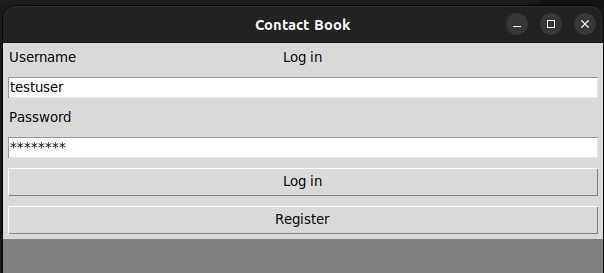
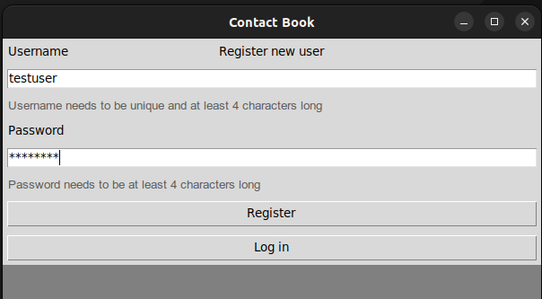
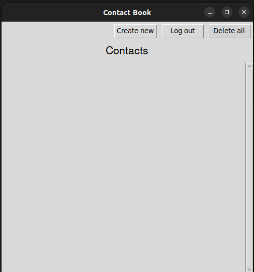
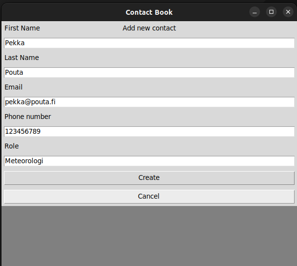
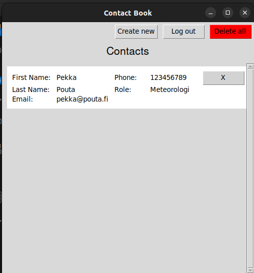
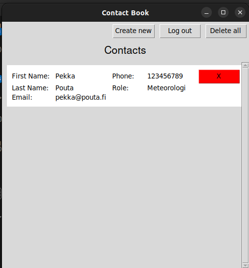

# Käyttöohje

Lataa projektin viimeisimmän [releasen](https://github.com/ranven/contactbook/releases) koodi Assets-otsikon alta. Vaihtoehtoisesti repositorion voi kloonata seuraavalla komennolla: `git clone https://github.com/ranven/contactbook.git`

## Sovelluksen käynnistys

Suorita seuraavat käskyt ennen sovelluksen käynnistämistä.

Asenna riippuvuudet komennolla:

`poetry install`

Alusta sovellus komennolla:

`poetry run invoke build`

Käynnistä sovellus komennolla:

`poetry run invoke start`

## Kirjautuminen ja rekisteröityminen

Sovelluksen käynnistysnäkymä on seuraava login-näkymä:

Jo rekisteröitynyt käyttäjä voi kirjautua sisään tässä näkymässä syöttämällä kenttiin käyttäjätunnuksen ja salasanan sekä painamalla "Log in"-painiketta. Uusi käyttäjä voi painaa "Register"-painiketta päästäkseen seuraavaan rekisteröitymisnäkymään:

Uusi käyttäjä voi rekisteröityä syöttämällä kenttiin vähintään 4 merkkiä pitkän käyttäjänimen ja vähintään 4 merkkiä pitkän salasanan sekä painamalla "Register"-painiketta. Mikäli syötetyt tiedot eivät vastaa vaatimuksia, antaa sovellus virheilmoituksen.

Mikäli kirjautuminen/rekisteröityminen suoritetaan onnistuneesti, siirrytään käyttäjän yhteystietojen listausnäkymään.

## Yhteystietojen luominen, katselu ja poistaminen

Kirjautunut käyttäjä voi nähdä yhteystietojen listausnäkymän, jonka yllä on kolme painiketta.

"Create new"-painiketta painamalla käyttäjä voi siirtyä luomaan uuden yhteystiedon.

Luomisnäkymässä käyttäjä voi syöttää uuden yhteystiedon etu- ja sukunimen, sähköpostiosoitteen, puhelinnumeron sekä roolin ja lopuksi painaa "Create"-painiketta luodakseen yhteystiedon ja lisätäkseen sen omaan yhteystietolistaansa. Puhelinnumeron tulee olla sarja numeroita, ja mikäli syöte ei vastaa tätä vaatimusta, ilmoittaa sovellus virheestä eikä yhteystiedon luonti onnistu.

Onnistuneen luomisen jälkeen käyttäjä siirtyy takaisin listausnäkymään, johon uusi yhteystieto on ilmestynyt. "Cancel"-painiketta painamalla käyttäjä siirtyy takaisin listausnäkymään luomatta uutta yhteystietoa.

Käyttäjä voi nähdä luomansa yhteystiedot listausnäkymässä. Käyttäjä voi poistaa kaikki luomansa yhteystiedot ja tyhjentää yhteystietolistansa painamalla "Delete all"-painiketta.

Käyttäjä voi poistaa yksittäisen yhteystiedon painamalla "X"-painiketta kyseisen yhteystiedon kohdalla.

Käyttäjä voi myös kirjautua ulos sovelluksesta painamalla "Log out"-painiketta, joka siirtää käyttäjän takaisin kirjautumisnäkymään.
