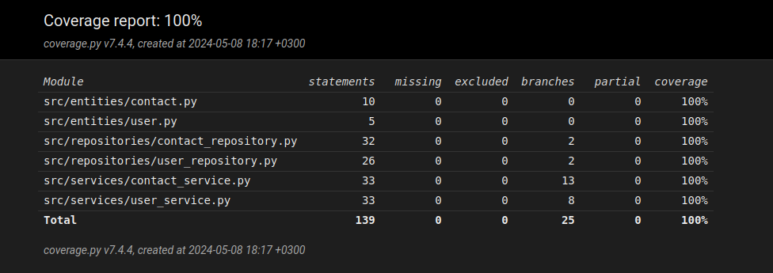

# Testausdokumentti

Ohjelman testaus on toteutettu manuaalisilla järjestelmätesteillä sekä automatisoiduilla yksikkö- ja integraatiotesteillä unittest-kirjaston avulla.

## Yksikkö- ja integraatiotestaus

### Services (sovelluslogiikka)

Sovelluslogiikan käyttäjien hallinnasta vastaavaa `UserService`-luokkaa on testattu [TestUserService](../src/tests/services/user_service_test.py)-testiluokalla. `UserService`-luokalle injektoidaan testejä varten luotu `FakeUserRepository`-luokka, joka imitoi `UserRepository`-luokan toimintaa tallentaen tiedot pysyväistallennuksen sijaan muistiin.

Sovelluslogiikan kontaktien hallinnasta vastaavaa `ContactService`-luokkaa on testattu [TestContactService](../src/tests/services/contact_service_test.py)-testiluokalla. ContactService-luokalle injektoidaan testejä varten luodut `FakeContactRepository` ja `FakeUserRepository`-luokat, jotka imitoivat `ContactRepository` ja `UserRepository`-luokkien toimintaa tallentaen tiedot pysyväistallennuksen sijaan muistiin.

### Repositoriot (tiedon tallennus)

Repository-luokkien toimintaa testaavat [TestUserRepository](../src/tests/repositories/user_repository_test.py) ja [TestContactRepository](../src/tests/repositories/contact_repository_test.py)-luokat. Repositoriot käyttävät testeissä eristettyä testitietokantaa, joka on konfiguroitu .env.test-tiedostoon.

## Testikattavuus

Sovelluksen testauksen haaraumakattavuus on 100%, ja ne testaavat kattavasti koko sovelluksen toimintaa.

Testien ulkopuolelle jää kurssin ohjeistuksen mukaisesti käyttöliittymäkerros sekä juurihakemiston tiedostot `db_connection.py`, `config.py`, `index.py` sekä `build.py`.

## Järjestelmätestaus

Sovelluksen järjestelmätestaus on tehty manuaalisesti.

### Konfigurointi

Sovellus on konfiguroitu [käyttöohjeen](./kayttoohje.md) mukaisella tavalla Cubbli Linux-ympäristöön. Sovellus on haettu lataamalla suoraan repositorion osoitteesta git clone-käskyllä sekä lataamalla sovelluksen eri releaset ja alustamalla ne ohjeiden mukaisesti. Sovellusta on testattu uusilla ja jo olemassa olevilla käyttäjätileillä sekä uusilla ja jo luoduilla kontakteilla.

### Toiminnallisuudet

Järjestemätestauksessa on käyty läpi kaikki [määrittelydokumentin](./vaatimusmaarittely.md) kattamat toiminnallisuudet. Testauksessa on huomioitu myös oikeellisten virheilmoitusten testaus, sekä virheellisillä syötteillä testaaminen.

## Sovelluksen laatuongelmat

Sovellukseen on jäänyt seuraavia laadullisia ongelmia:

- Sovellus ei ilmoita virheestä kun tietokannan alustuskäskyä `poetry run invoke build` ei ole suoritettu.
- Sovelluksen käyttöliittymässä on toisteisuutta, jota voisi eriyttää näkymien kesken jaetuiksi komponenteiksi.
